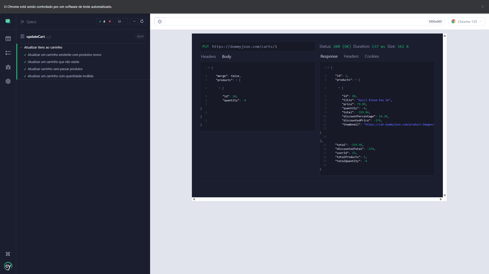

# Teste de Automação API

### Neste repositório contém:
- Teste de Automação API com Cypress

## Teste de Automação API

Este projeto inclui testes automatizados com Cypress para verificar se as funcionalidades da API estão operando corretamente.

Cenarios de testes -> **Link**: [Teste de Automação API](https://github.com/matheusgama30/AutomacaoCypressAPI/blob/main/Automa%C3%A7%C3%A3o_Cypress_API/Automa%C3%A7%C3%A3oAPI.md)

A API testada foi a do DummyJSON - Carts, que oferece uma estrutura simples e robusta para simular operações reais de e-commerce. **Link**: [DummyJSON](https://dummyjson.com/docs/carts)



### Pré-requisitos

- Node.js - versão 20.11.0 ou superiorou superior
    - Instalação: 
        - Acesse o site oficial do Node.js: https://nodejs.org/
        - Baixe o instalador adequado para o seu sistema 
        - Execute o instalador e siga as instruções na tela.

### Configuração do Ambiente

1. Clone o Repositório
    - Realize o clone do projeto. (Caso já tenha feito o clone do repositrio no procedimento anterior, não precisa realizar novamente!)
    - `git clone https://github.com/matheusgama30/AutomacaoCypressAPI.git`

2. Acesse a Pasta do Projeto
    - `cd Automação_Cypress_API`

3. Instale as Dependências
    - execute o comando no terminal `npm install`
    - **cypress-plugin-api** é um plugin que facilita a visualização e depuração de testes de API no Cypress. Ele adiciona o comando ``` cy.api() ```, que funciona como ``` cy.request()```, mas com uma interface melhor no painel do Cypress.

4. Como Rodar os Testes
    - Para rodar os testes, execute:
        1. o comando no terminal ```npx cypress open```
        2.  Escolha o navegador desejado
        3. Selelcione a Spec desejada para rodar os testes

5. Como Rodar os Testes em modo headless
    1.  execute o comando no terminal `npm run test` 